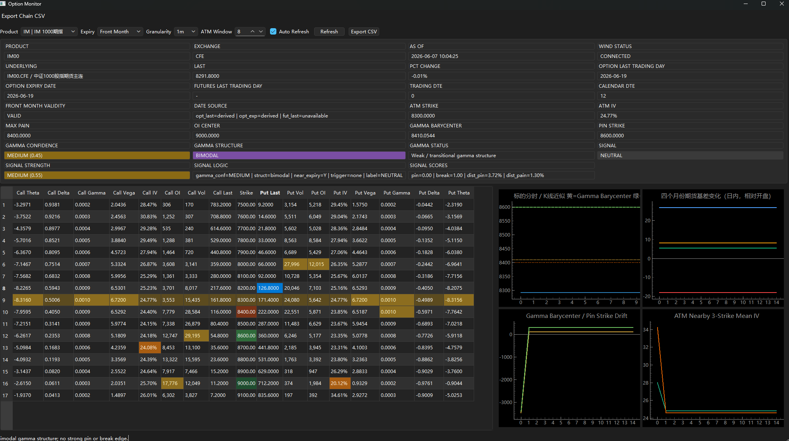

# Option Monitor

## Screenshot



基于 `Python + PySide6 + pyqtgraph` 的股指期货 / 指数期权监控 MVP，当前产品目录覆盖：

- `IH` 上证50期指，对应 `HO` 50指数期权
- `IF` 沪深300期指，对应 `IO` 300指数期权
- `IC` 中证500期指
- `IM` 中证1000期指，对应 `MO` 1000指数期权

## 架构

- `main.py`: 程序入口。
- `config/settings.yaml`: 产品目录、刷新频率、信号阈值、Wind 字段映射。
- `data/wind_client.py`: Wind 连接、重试、mock 降级。
- `data/option_loader.py`: 期权链和分时数据加载。
- `data/quote_updater.py`: 后台刷新线程，输出统一的 `MarketSnapshot`。
- `core/calculations.py`: ATM、Max Pain、OI Center、Gamma Center、IV 结构。
- `core/signal_engine.py`: Pin / Break 规则引擎。
- `ui/`: 摘要区、期权链表格、图表区、主窗口。
- `tests/`: 计算与信号基础测试。

## 数据流

1. `MainWindow` 加载配置并初始化 `WindClient`。
2. `QuoteUpdater` 定时触发后台刷新。
3. `WindClient` 返回实时行情、期权链、分时/K线。
4. `core` 模块计算衍生指标并生成状态标签。
5. `MarketSnapshot` 推送到 UI，界面增量刷新表格和图表。

## UI 布局

- 顶部: 时间、Wind 状态、标的、ATM IV、Max Pain、Gamma Center、状态标签。
- 左侧: Put/Strike/Call 结构化期权链。
- 右侧: 价格、OI、Gamma、IV 图表。
- 工具栏: 到期月份切换、K线粒度切换、自动刷新、手动刷新、ATM 窗口控制、CSV 导出。

## 运行

```powershell
python -m pip install -r requirements.txt
python main.py
```

如果本机安装并登录了 Wind 终端，程序会优先尝试连接 `WindPy`。产品可在界面顶部的 `Product` 下拉框切换。

## 测试

```powershell
pytest -q tests -p no:cacheprovider
```

当前仓库根目录存在几个受限的临时目录，直接跑 `pytest` 全量收集会被这些目录阻塞，所以建议显式指定 `tests/`。

## Wind MCP Server

仓库内新增了一个基于 stdio 的 MCP 服务入口：

```powershell
python wind_mcp_server.py
```

当前暴露的 MCP tools：

- `wind_status`
- `list_products`
- `get_quote`
- `get_option_chain`
- `get_intraday_bars`
- `get_basis_curve`

如果你要接到支持 MCP 的客户端，可以把启动命令配置成：

```json
{
  "command": "python",
  "args": ["C:/Users/macon/code/option monitor/wind_mcp_server.py"]
}
```

说明：

- 服务默认读取 `config/settings.yaml`
- 启动前需要本机可用的 `WindPy` 环境和 Wind 终端登录态
- 如果 `app.use_mock_on_wind_failure` 为 `true`，Wind 不可用时会自动退回 mock 数据

## 后续扩展

- 将 `wind_client.py` 里的 `NotImplementedError` 替换为你的本地 `wset/wss/wsi` 精确字段。
- 增加多月合约对比和本地历史缓存。
- 将简化的 Gamma 权重升级为更完整的 dealer GEX 估算。
- 增加图表截图导出和到期日预警。
